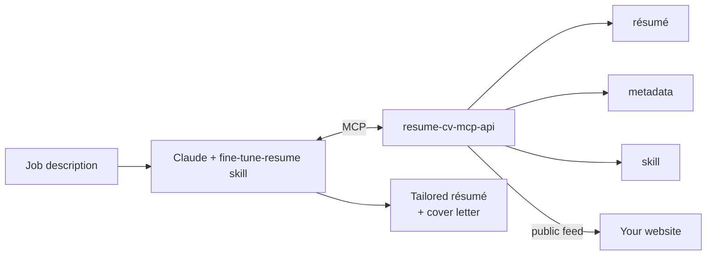

# resume-cv-mcp-api

A résumé/CV — not anything about resuming a process — served as structured
data over HTTP and MCP.

Used to store and serve JSON résumés, résumé metadata (also JSON), and 
fine-tuning skills as JSON. A user may have multiples of these documents. These
document is server via a both public (optional) and private REST endpoints, as 
well as via MCP tools.

Documents may optionally be marked as public. Additionally, sections within a résumé
may be hidden from the public feed.

## Author's Note

**Q:** What problem(s) does this solve?

**A:** This micro-ish service enables me to:
- Have a single source of truth for my résumé in a structure format.
- Track changes/revisions to my résumé.
- Feed into my personal website, which can also compile this structured 
resume into a master resume page and docx file (minus personal contact info).
- Have a centralized place to store and track resume metadata, and 
fine-tuning-skill prompts.
- Run `/fine-tune-resume` in Claude (or potentially others) from anywhere, on 
any device that supports MCP, along with any job description, and receive a 
pretty good fine-tuned-resume and cover letter to use for a recruiter or job 
application.
- Potentially let friends use this for the same purpose.

**Q:** Why does this exist?

**A:** It's 2026, and I've been job hunting for a little while now. I've found myself 
frustrated by multiple activities that I'm intended to repeat, day in, and day out.
This includes:
- An expectation to fine tune my résumé for every job, for every recruiter. Keywords 
must match (even if it is the most mundane nonsensical thing you've ever heard of.)
- Fine-tuning must be done quickly, or expect a call back asking for when it's done.
And then another call. Whether you happen to be at your computer or not.
- Regularly having to update my résumé with new history or skills, because I got a new 
cert, or just never thought that a particular thing was worth mentioning. Then losing 
that update, because I made it in a fine-tuned resume, and not in a master.
- Updating the public master resume, private master resume, and website, every time. 

**Q:** Why this way?

**A:** https://xkcd.com/1319/ 

**Q:** Where's the gui?

**A:** There is a separate repo, intended to be made public alongside this one:
[resume-cv-mcp-api-web-client](https://github.com/tristankerner/resume-cv-mcp-api-web-client)

At the end of the day, I don't know that this project will be particularly useful for 
anyone else. For the most part, it was something I wanted, for my workflow, and a way 
to practice using Claude Code with a stack that I'm already familiar with. It was also 
a chance to dive into MCP (using FastMCP), and work with skills.

There is almost certainly a simpler way to do what I/"we" have done here. Also, an 
easier way. Certainly better ways if your intent is to mass-apply to jobs, instead
of being as selective as I'm being.

I also can't really say how well this works... it certainly does what it's intended
to do. I like the results of both the résumé and cover letter compared to some other
manual approaches I've tried. However, I also haven't gotten a job with it yet, which 
is the real point.

## How it fits together



## Quick Start

Everything below runs on your own machine. You need **Docker** and, for step 4,
**Node** (for `npx`).

### 1. Run it

```bash
cp .env.example .env
```

Fill in three values in `.env`:

| Setting | Value |
| --- | --- |
| `AUTH_SECRET_KEY` | `python3 -c "import secrets; print(secrets.token_urlsafe(64))"` |
| `BOOTSTRAP_ADMIN_USERNAME` | whatever you like |
| `BOOTSTRAP_ADMIN_PASSWORD` | 8+ chars with upper, lower, digit and symbol |

Then build the base image and start the stack with the browser client baked in:

```bash
docker compose build && docker compose -f docker-compose.web-client.yaml up --build
```

The two commands are separate on purpose — Compose can't chain one service's
image into another's build. Both steps are needed only the first time and after
you pull changes.

### 2. Log in

Open **http://localhost:8000/client** and sign in with the bootstrap admin
username and password from `.env`. They create the account on first start only,
and are ignored afterwards.

### 3. Make the documents yours

Your new account already holds three documents — a `resume`, a `metadata` and a
`skill` — seeded with fictional example content. Edit them in the client:

| Edit this | To change |
| --- | --- |
| `resume` | Your actual history, skills, contact details |
| `metadata` | What each résumé field means (usually leave as-is) |
| `skill` | The tailoring instructions Claude follows |

Start with the `resume`. The other two are already sensible defaults — see
[Document Types](docs/document-types.md) for what each one holds and when to
touch it.

### 4. Connect Claude Desktop

Mint an API key from the client's **API Keys** screen with exactly three
scopes — `resume:read`, `metadata:read`, `skill:read`. The secret is shown
once, so copy it now.

**Quit Claude Desktop completely** before editing its config — the app rewrites
the file from memory and will discard your changes otherwise.

| OS | Config file |
| --- | --- |
| Linux | `~/.config/Claude/claude_desktop_config.json` |
| macOS | `~/Library/Application Support/Claude/claude_desktop_config.json` |
| Windows | `%APPDATA%\Claude\claude_desktop_config.json` |

Merge this into the existing top-level object (don't replace the file):

```json
{
  "mcpServers": {
    "resume": {
      "command": "npx",
      "args": [
        "-y", "mcp-remote",
        "http://localhost:8000/resume/mcp",
        "--header", "Authorization: Bearer YOUR_KEY"
      ]
    }
  }
}
```

Start Claude Desktop again. It should list `list_resume_documents` and
`retrieve_resume_data` under the `resume` server.

### 5. Add the skill and tailor a résumé

[`examples/SKILL.md`](examples/SKILL.md) is the skill that drives a tailoring
run. Package it as a folder and upload it:

```bash
mkdir fine-tune-resume && cp examples/SKILL.md fine-tune-resume/ && zip -r fine-tune-resume.zip fine-tune-resume
```

In Claude Desktop, first enable **code execution and file creation** under
**Settings → Capabilities** — skills need both. Then go to **Skills**, click
**+ → Create skill → Upload a skill**, and pick `fine-tune-resume.zip`. Toggle
it on once it appears. Skills are attached to your account, so it shows up on
claude.ai and mobile too.

Using Claude Code instead? Drop the folder in `~/.claude/skills/` and skip the
zip.

The skill file carries nothing personal and never goes stale — every rule,
bullet and output format lives in your `skill` document on the server instead.

Now paste a job description into Claude and ask for a tailored résumé:

> Here's a job description — fine tune my resume for it.
> *[paste the posting]*

Claude calls `list_resume_documents`, retrieves all three documents in one
call, follows your `skill` document's procedure, and returns a tailored résumé
and cover letter.

## Document Types

Three JSON documents per account, each with its own read/write/delete scopes
and full revision history.

| Type | Holds |
| --- | --- |
| `resume` | A [JSON Resume 1.0](https://jsonresume.org/schema) document — work history, bullets, skills, contact details — extended with private fields for tailoring |
| `metadata` | What each résumé field means and which parts are résumé-ready |
| `skill` | The persona, procedure, wording rules and output specs a tailoring run follows |

Keeping instructions in a document rather than in the skill file means editing
them is a document write — the next run picks them up with no skill release.

**→ [Document Types](docs/document-types.md)** — schemas, revisions, publishing,
and the public feed.

## Application Tracking

Companies, contacts, applications and the events on them (status changes,
notes, ratings) — a job hunt tracked alongside the résumé that was sent for
each one, with résumé/metadata/skill document references, attachments, and an
audit trail of every change. `applications:*`, `companies:*` and `contacts:*`
scopes, per entity, plus `audit:read`.

The `preview_record_application` MCP tool, committed with `confirm`, is meant
to run at the end of a tailoring session: search for the company
first, tailor the résumé, then preview and confirm the application with the
documents actually used — see `examples/resume.skill.example.json`'s
`offer-application-record` step.

**→ [API Reference](docs/api.md#application-tracking)** — every endpoint;
**→ [Security](docs/security.md#audit-log)** — what the audit log records.

## MCP Client

The server speaks **Streamable HTTP** at `/resume/mcp`, authenticated by either
a static API key or OAuth 2.1.

| Client | API key | OAuth |
| --- | --- | --- |
| Claude Code | yes | yes |
| Claude Desktop / web / mobile | via `mcp-remote` bridge | yes |
| Gemini CLI | yes | — |
| Copilot (VS Code) | yes | — |
| ChatGPT | no | yes |

Claude Desktop and claude.ai are the best-supported path. Everything else works;
the differences are in how each one stores the credential.

**→ [MCP Clients](docs/mcp-clients.md)** — per-client configuration and
troubleshooting.

## Security

| Credential | Lifetime | For |
| --- | --- | --- |
| **JWT** (`POST /token`) | short, refreshable via `POST /token/refresh` | People, and anything managing credentials |
| **API key** (`rsm_…`) | long | Machine clients, scoped below their owner |
| **OAuth 2.1** | refreshable | MCP connectors that speak it |

Permissions are scopes, one per document type per verb — `resume:read`,
`skill:write`, and so on — plus `users:admin`. A key's effective scopes are its
own intersected with its owner's, so a key can be narrowed but never widened.
TOTP and backup codes are available per account; failed password logins are
throttled per account and per address.

**Passkeys** are a passwordless *first* factor, not a second one — a
registered passkey signs in on its own, without also demanding a TOTP code.
They're available at `/token` (the browser client), `/docs/login`, and
`/oauth/authorize`, and are off entirely unless `WEBAUTHN_RP_ID` and
`WEBAUTHN_ALLOWED_ORIGINS` are set — see `.env.example`.

**→ [Security](docs/security.md)** — scopes, roles, MFA, throttling and account
recovery.

## API

Every endpoint, with its required scope and whether an API key is enough.

**→ [API Reference](docs/api.md)**

Interactive docs are served at `/docs`, `/redoc` and `/openapi.json` — open in
development, behind a login when `ENVIRONMENT=production`.

## Server Setup

Running this on a VPS with a real domain, HTTPS and Let's Encrypt certificates.

**→ [Server Setup](docs/server-setup.md)** — configuration reference, Docker
Compose with Caddy, firewall ports and OAuth client registration.

## Development

**→ [Development](docs/development.md)** — native Python, tests, pre-commit,
databases and project layout.

## Planned Features

- [ ] **MCP write-back tools** — append a new bullet, skill or certification to
  the master résumé from inside a conversation, so an update made mid-tailoring
  lands in the source of truth instead of a one-off copy.

## Contributing

This is a personal project, built for one workflow and shared in case it's
useful to someone else. Issues and questions are welcome — pull requests aren't
expected, and there's no process to follow if you'd like to send one anyway.

Forking it and making it yours is very much encouraged.
