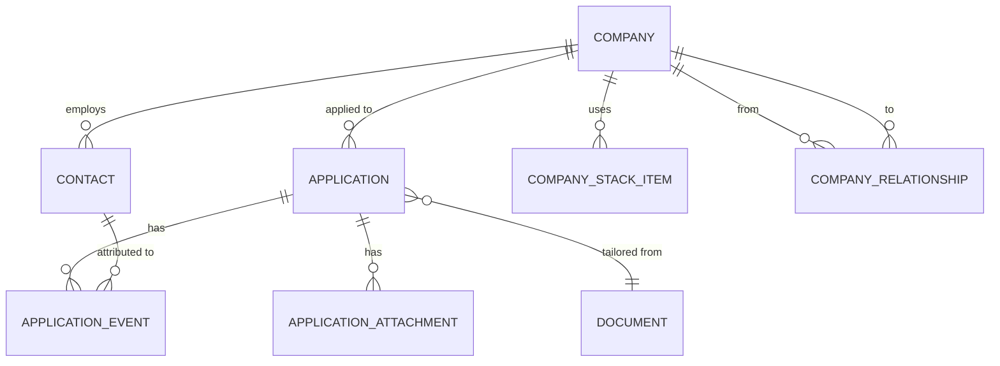

# API Reference

Every endpoint, generated from the service's own OpenAPI schema. The live,
interactive version is served at `/docs` and `/redoc` — open in development,
behind a login in production.

**Auth column:** _none_ takes no credential · _key_ accepts an API key or a
JWT · _login_ requires an interactive password JWT and refuses API keys.

## Authentication

| Method | Path | Auth | Purpose |
| --- | --- | --- | --- |
| `POST` | `/token` | none | Password login. Form-encoded `username`, `password`. |
| `POST` | `/token/mfa` | none | Redeem an MFA challenge. Form-encoded `mfa_token`, `code`. |
| `POST` | `/token/refresh` | none | Exchange a refresh token for a new access token and a new refresh token. Form-encoded `refresh_token`. |
| `POST` | `/token/logout` | none | Revoke the whole session chain a refresh token belongs to. Form-encoded `refresh_token`. `204` on success, including for an already-unknown token. |

`POST /token` returns one of two shapes. Without a second factor enrolled:

```json
{"access_token": "…", "token_type": "bearer", "refresh_token": "…"}
```

With one, a challenge to redeem at `/token/mfa` — so a script that reads
`.access_token` straight off this response gets `null` for an enrolled account:

```json
{"mfa_required": true, "mfa_token": "…", "methods": ["totp"], "expires_in": 300}
```

`/token/mfa` and `/token/refresh` both return the first shape. Every login
path issues the same kind of token, so any of them satisfies the
interactive-login requirements below.

`refresh_token` is opaque, hashed at rest, and rotated on every use: each
`/token/refresh` call returns a new refresh token and the one presented stops
working. It is single-use in one specific sense — presenting an
already-rotated token is treated as reuse and revokes every token descended
from that login, not just the one presented. It expires after
`AUTH_REFRESH_TOKEN_EXPIRE_DAYS` (14 by default) and carries no scope of its
own; a refresh always mints an access token scoped to the account's current
role scopes. MFA is not re-challenged on refresh — the refresh token is only
ever issued after MFA has already been satisfied for that login.

## Datetime format

Every `datetime` field in a response body is RFC 3339 UTC with a literal `Z`:
`"2026-09-09T12:00:00Z"`. Sub-second precision may or may not be present;
don't depend on it either way. A request body may send any offset, or none —
no offset means UTC. Either way, the value stored is naive UTC; the API never
renders a user's local time itself. `users.timezone` exists so a client knows
what to convert to (see [Users](#users)).

`date`-typed fields — `applications.date_submitted` is the only one — are bare
calendar dates, `"2026-09-09"`, with no time component and no timezone. They
are calendar days, not instants, and are never converted.

## Documents

| Method | Path | Auth | Purpose |
| --- | --- | --- | --- |
| `GET` | `/documents` | any read scope | List your documents — name, type, public flag, latest revision and note. No content. |
| `GET` | `/documents/schemas` | any read scope | JSON Schema for each type you may read. |
| `GET` | `/documents/resume/{name}` | `resume:read` | Read a résumé. `?revisions=1..50&order=newest_first\|oldest_first` |
| `GET` | `/documents/metadata/{name}` | `metadata:read` | Read a metadata document. Same query parameters. |
| `GET` | `/documents/skill/{name}` | `skill:read` | Read a skill document. Same query parameters. |
| `POST` | `/documents/resume` | `resume:write` | Create or append a revision. Body: `name`, `data`, optional `public`, `revision_note`. |
| `POST` | `/documents/metadata` | `metadata:write` | As above, typed `metadata`. |
| `POST` | `/documents/skill` | `skill:write` | As above, typed `skill`. |
| `PATCH` | `/documents/{name}` | stored type's **write + delete** | Rename. Writes rows under the new name and removes the old, hence both scopes. |
| `DELETE` | `/documents/{name}` | stored type's **delete** | Delete a document and all its revisions. |

Reads always return `{"data": [ ... ]}`. Writes return
`{"name", "revision_id", "status"}`, where `status` is `"created"` or
`"unchanged"`. See [Document Types](document-types.md).

`POST /documents/resume` is whole-document replace and has **no MCP
equivalent by design**. The MCP write surface (`describe_resume_schema` /
`preview_resume_patch` / `confirm`, see [MCP](#mcp) below) is a
closed set of additive patch operations instead — a model never hands over a
whole document over MCP. `metadata` and `skill` documents have no MCP write
path at all, HTTP-only, in either shape.

## Public feed

| Method | Path | Auth | Purpose |
| --- | --- | --- | --- |
| `GET` | `/public/{username}/resume/{name}` | none | The redacted public projection of a `public` résumé. |
| `GET` | `/public/users/{user_id}/resume/{name}` | none | The same, addressed by user id. |

Both answer with `Access-Control-Allow-Origin: *`. A private document is a
`404`, never a `403` — whether one exists isn't disclosed.

## API keys

| Method | Path | Auth | Purpose |
| --- | --- | --- | --- |
| `POST` | `/api-keys` | **login** | Mint a key. Body: `name`, `scopes`. The secret is in the response and not recoverable afterwards. |
| `GET` | `/api-keys` | key | List your keys — metadata only, never the secret. |
| `DELETE` | `/api-keys/{key_id}` | **login** | Revoke. Soft delete, so `last_used_at` stays readable. |

Self-service only, on your own keys. A key can read the list but can't mint or
revoke — so a leaked key cannot issue its own replacement ahead of revocation.

Requested scopes are capped at the owner's current role scopes, reloaded at
mint time rather than taken from the token.

## Users

| Method | Path | Auth | Purpose |
| --- | --- | --- | --- |
| `GET` | `/users/me` | key | Your own account. |
| `POST` | `/users/me/password` | **login** | Change your own password. Requires the current one. |
| `PATCH` | `/users/{user_id}` | key, or **login** for recovery fields | Edit an account. `password`, `username`, `email` and `roles` require an interactive login; `timezone` does not. |
| `GET` | `/users` | key + `users:admin` | List every user. |
| `POST` | `/users` | **login** + `users:admin` | Create an account. Seeded with the three example documents. |
| `POST` | `/users/{user_id}/password` | **login** + `users:admin` | Admin password reset, bypassing the current one. |
| `DELETE` | `/users/{user_id}/lock` | key + `users:admin` | End a login lockout. |
| `DELETE` | `/users/{user_id}/mfa` | **login** + `users:admin` | Strip every second factor from an account. |

Passwords must be 8+ characters with upper, lower, digit and symbol.

`GET /users/me` and `GET /users` both carry `timezone` — an IANA name
(`"America/Chicago"`) or `null` for UTC. `PATCH /users/{user_id}` accepts the
same shape; an unknown name is a `422`. Display-only: the API always emits UTC
(see [Datetime format](#datetime-format) above) and never renders a user's
local time itself — this is what a client converts with.

## Multi-factor authentication

All self-service, on your own account, and **all require an interactive
login** — an API key cannot read or change second factors, the same rule key
management follows.

| Method | Path | Auth | Purpose |
| --- | --- | --- | --- |
| `GET` | `/users/me/mfa` | **login** | Enrolled methods and their status. |
| `POST` | `/users/me/mfa/totp` | **login** | Begin TOTP enrolment. Returns the secret and provisioning URI. |
| `POST` | `/users/me/mfa/totp/{credential_id}/activate` | **login** | Confirm enrolment with a code from the app. |
| `POST` | `/users/me/mfa/backup-codes` | **login** | Generate a set of single-use codes, replacing any previous set. |
| `DELETE` | `/users/me/mfa/{credential_id}` | **login** | Remove one method. Body carries the current password. |

## OAuth 2.1

| Method | Path | Auth | Purpose |
| --- | --- | --- | --- |
| `GET` | `/.well-known/oauth-authorization-server` | none | RFC 8414 metadata. `registration_endpoint` is absent when registration is closed. |
| `GET` | `/.well-known/oauth-protected-resource/resume/mcp` | none | RFC 9728 resource metadata, pointing at the authorization server. |
| `GET` | `/oauth/authorize` | none | Login and consent page. |
| `POST` | `/oauth/authorize` | none | Submit login and consent; redirects with a code. |
| `POST` | `/oauth/token` | client credentials | Exchange a code, or refresh. PKCE `S256` required. |
| `POST` | `/oauth/revoke` | client credentials | Revoke a refresh token. |
| `POST` | `/oauth/register` | none | Dynamic Client Registration. `404` unless `OAUTH_REGISTRATION_ENABLED=true`. |

### Client administration

| Method | Path | Auth | Purpose |
| --- | --- | --- | --- |
| `GET` | `/oauth-clients` | **login** + `users:admin` | List registered clients. |
| `POST` | `/oauth-clients` | **login** + `users:admin` | Register a client. The secret is shown once. |
| `DELETE` | `/oauth-clients/{client_id}` | **login** + `users:admin` | Deregister, invalidating every code and refresh token it holds. |

Redirect URIs are checked against `OAUTH_ALLOWED_REDIRECT_HOSTS` at
registration **and again at every authorization**, so it's live policy rather
than a one-time gate.

## Application tracking

Companies, contacts, applications and their sub-resources — a job hunt, not a
résumé. Every row is scoped to its owner; a row belonging to someone else is a
`404`, never a `403`. List endpoints return
`{"data": [...], "total", "limit", "offset"}`. `PATCH` is partial: an absent
field is left alone, an explicit `null` clears it.



A `COMPANY_RELATIONSHIP` is directional (`from_company_id` → `to_company_id`
with a `type` that reads in that direction) and traversed in both directions
when resolving a contact — `GET /applications/{id}/contact-options` walks it
outward from the application's own company up to 3 hops either way, not just
downstream. An `APPLICATION`'s `status` is *derived* from its
`APPLICATION_EVENT`s rather than set directly — the most recent event's
status by `occurred_at`, or `submitted` with none. The `DOCUMENT` edge is by
`(name, revision_id)` rather than a surrogate key, which is why deleting a
document has to clear those references on every application that names it
before the document itself can go.

### Companies

| Method | Path | Auth | Purpose |
| --- | --- | --- | --- |
| `GET` | `/companies` | `companies:read` | Search by `query`; `sort` = `name`\|`-name`\|`created_at`\|`-created_at`. |
| `POST` | `/companies` | `companies:write` | Create. `409` on a near-duplicate name; `confirm_create_duplicate: true` overrides a fuzzy match (not an exact one). |
| `GET` | `/companies/{id}` | `companies:read` | Detail: relationships, stack, contacts, up to 20 recent applications. |
| `PATCH` | `/companies/{id}` | `companies:write` | Update. `409` if the new name collides. |
| `DELETE` | `/companies/{id}` | `companies:delete` | `409` if any application still references it. |
| `POST` / `PATCH` / `DELETE` | `/companies/{id}/relationships`, `/company-relationships/{id}` | `companies:write`/`delete` | Directed edges between two of your own companies. `409` on an exact repeat (same direction, same type) or an inverse duplicate — e.g. `Acme parent_of Globex` when `Globex child_of Acme` already exists states the same fact. Paired types are `child_of`/`parent_of` and `customer_of`/`vendor_of`, plus `partner_of` with itself; `staffing_agency_for` and `acquired_by` are directional, so the reverse edge is a different fact and is allowed. The inverse edge is never auto-created. |
| `GET` / `POST` | `/companies/{id}/stack` | `companies:read`/`write` | Technologies observed at the company. Same dedup rule as companies. |
| `PATCH` / `DELETE` | `/company-stack/{id}` | `companies:write`/`delete` | |

### Contacts

| Method | Path | Auth | Purpose |
| --- | --- | --- | --- |
| `GET` | `/contacts` | `contacts:read` | Filter by `company_id`, `query`. |
| `POST` | `/contacts` | `contacts:write` | Requires at least one of `first_name`, `last_name`, `email`. `409` on a matching email or a fuzzy name match within the same company. |
| `GET` / `PATCH` / `DELETE` | `/contacts/{id}` | `contacts:read`/`write`/`delete` | Deleting a contact nulls its `contact_id` on any `application_events` row that named it. |

### Applications and events

| Method | Path | Auth | Purpose |
| --- | --- | --- | --- |
| `GET` | `/applications` | `applications:read` | Filters: `company_id`, repeatable `status`, `source`, `system`, `query`, `job_code`, `submitted_from`/`submitted_to`, `has_attachments`. |
| `POST` | `/applications` | `applications:write` | `company_id` required. `409` on a near-duplicate: an existing application with the same `job_code`, or the same company with a similar title and a submission date within 14 days. |
| `GET` / `PATCH` / `DELETE` | `/applications/{id}` | `applications:read`/`write`/`delete` | `PATCH` rejects a `status` field with `422` — status is derived, never set directly. Changing `job_code` to one another application already carries is a `409`, exactly like create; `confirm_create_duplicate: true` overrides. The fuzzy title/company/date heuristic stays create-only. Delete cascades to its events and attachments. |
| `GET` / `POST` | `/applications/{id}/events` | `applications:read`/`write` | A status change, a note, a rating, or any combination — at least one is required on create. |
| `PATCH` | `/application-events/{id}` | `applications:write` | |
| `DELETE` | `/application-events/{id}` | `applications:delete` | **Returns `200`, not `204`** — the body carries the application's recomputed status. |
| `GET` | `/applications/{id}/contact-options` | `applications:read` **and** `contacts:read` | Contacts plausibly involved in this application, reached by walking `company_relationships` out from its own company — up to 3 hops, both directions, capped at 200 companies. `query` filters like `GET /contacts`; `limit` defaults to 200 (max 500). Each row carries `depth` (0 = the application's own company) and `via`, the chain of intermediate company names. Shapes what a client *offers*, not an authorization boundary — `POST`/`PATCH` on an event still accepts any contact the caller owns, whether or not it appears here. |

`job_code` is the requisition code, optional and free-form. Matching folds
away case and separators, so `REQ-12345`, `req 12345` and `REQ12345` are one
code — which is the point, since two recruiters putting the same requisition
forward rarely spell it the same way. Matching is **not** scoped to the
company, for the same reason: the second submission usually arrives through a
different agency. A code with fewer than three alphanumeric characters is
stored and shown but never matched on, since it would collide with everything.

Every summary carries `job_code_match_count`, the number of *other*
applications sharing its code, and `GET /applications/{id}` carries
`related_by_job_code` — those applications in full. Filtering by
`?job_code=` folds the same way.

An application's `status` is always the status of its most recent event by
`occurred_at`; `submitted` when it has none. `GET /tracking/enums` (any one
tracking read scope) lists every status, stack item type, relationship type
and attachment kind, with display labels and which statuses are terminal.

### Attachments

| Method | Path | Auth | Purpose |
| --- | --- | --- | --- |
| `GET` / `POST` | `/applications/{id}/attachments` | `applications:read`/`write` | Body: `kind`, `filename`, `content_type`, `content_base64`. PDF and `.docx` only, 10 MiB decoded cap. List returns metadata only. |
| `GET` | `/attachments/{id}` | `applications:read` | Metadata **plus** `content_base64`. |
| `DELETE` | `/attachments/{id}` | `applications:delete` | |

Upload errors: `415` (unsupported or mismatched content type), `422`
(malformed base64), `413` (over the size cap), `409` (identical bytes already
attached — no override).

### Audit

| Method | Path | Auth | Purpose |
| --- | --- | --- | --- |
| `GET` | `/audit` | `audit:read` | Your own rows only, filterable by `table` and `row_id`. `table` must be one of the audited tables or `422`. |

Records every write to `applications`, `application_events`,
`application_attachments`, `companies`, `company_relationships`,
`company_stack_items`, `contacts`, `users` and `api_keys` — never a secret
column, and never `documents`, which is append-only and is its own history.
See [Security](security.md).

### Duplicate-conflict body

The one place `detail` is an object rather than a string, returned by every
`409` above that names `confirm_create_duplicate`:

```json
{
  "detail": {
    "code": "duplicate_company",
    "message": "3 companies already look like \"Plaid\". Use one of them, or resend with confirm_create_duplicate: true.",
    "candidates": [
      { "id": 12, "label": "Plaid", "match": "exact", "score": 1.0, "hint": "8 applications" }
    ]
  }
}
```

## MCP

| Path | Transport | Auth |
| --- | --- | --- |
| `/resume/mcp` | Streamable HTTP | API key or OAuth token |

**Read tools:**

| Tool | Scope | Returns |
| --- | --- | --- |
| `list_resume_documents` | any of the three read scopes | Your documents — id, type, public, revision, note, created_at. No content. Only types the credential may read. |
| `retrieve_resume_data` | `resume:read`, plus `metadata:read` / `skill:read` when those ids are passed | All three documents in one call. A companion that isn't stored comes back `null`. |
| `search_companies`, `get_company`, `search_company_relationships` | `companies:read` | Look up an existing company, or its relationships, before writing anything. |
| `search_contacts` | `contacts:read` | |
| `search_applications`, `get_application` | `applications:read` | Summary search excludes job description, prompt text and attachments; `get_application` never returns attachment content. |
| `describe_resume_schema` | `resume:read` | What the resume write-back operations are, their arguments, worked examples, and what is not changeable. Call before proposing any resume change. |

**Write tools — every one is a `preview_*` call followed by `confirm`:**

| Tool pair | Scope (`preview_*` / `confirm`) | Writes |
| --- | --- | --- |
| `preview_resume_patch` / `confirm` | `resume:read`+`resume:write` / `resume:write` | A closed set of additive patch operations against the resume's latest revision — see `describe_resume_schema`. |
| `preview_create_company` / `confirm` | `companies:read`+`companies:write` / `companies:write` | A company. Dedup-checked exactly like `POST /companies`. |
| `preview_add_company_stack_items` / `confirm` | `companies:read`+`companies:write` / `companies:write` | One or more stack items in a batch; each is deduplicated on its own, a near-duplicate is listed as skipped rather than failing the batch. |
| `preview_create_company_relationship` / `confirm` | `companies:read`+`companies:write` / `companies:write` | A directed edge between two companies. Same duplicate/inverse-duplicate rule as `POST /companies/{id}/relationships`. |
| `preview_create_contact` / `confirm` | `contacts:read`+`contacts:write` / `contacts:write` | A contact. Never invents one — only records one the user names or the posting states. |
| `preview_record_application` / `confirm` | `applications:read`+`applications:write` (+`companies:read`+`companies:write` to preview a new company) / `applications:write` | The composite pair for the end of a tailoring run — one of `company_id`/`company_name`, plus the documents actually used. |
| `preview_add_application_event` / `confirm` | `applications:read`+`applications:write` / `applications:write` | A status change, a note, a rating, or any combination. |
| `preview_add_attachment` / `confirm` | `applications:read`+`applications:write` / `applications:write` | A file on an application. Content-type, size, and magic-byte checks all run at preview time. |

Every tool returns a single text content block with no `structuredContent`
mirror, which halves the token cost of a call.

**This is a breaking change from the previous MCP tool surface**: `create_company`,
`create_contact`, `record_application`, `add_application_event` and
`add_company_stack_items` used to write directly. They are now previewed and
then committed through `confirm`; there is no deprecation window. The eight
per-tool `confirm_*` tools that briefly replaced them are gone too — one
`confirm` commits any preview, since the token already records which one.

### The preview/confirm pattern

Every write is two calls. `preview_*` resolves the request against the
current data — dedup checks, reference checks, document validation — and
returns exactly what would be written plus a `confirm_token`. Nothing is
written yet. `confirm` takes that token, and nothing else, and performs the
write it authorizes, dispatching on what the token was issued for.

Its result is `{"confirmed": "<tool name>", "result": { /* that tool's own
result */ }}` — `confirmed` is how a client knows which write it just
committed without having tracked the token itself.

```json
{"preview": { /* what would be written */ }, "confirm_token": "…", "expires_in": 600}
```

Three facts a client author needs: the token is **single-use** — a second
`confirm` call with the same token is refused, and nothing is written the
second time; it **expires** after `expires_in` seconds (600 by default); and
it carries **its own scope requirement** — a credential holding
`companies:write` alone cannot commit a previewed application, and is refused
before the token is consumed rather than after. A blocked duplicate at preview time raises a `ToolError`
listing the near-matches by id, so the model can reuse one or preview again
with `confirm_create_duplicate: true`.

## Other

| Method | Path | Auth | Purpose |
| --- | --- | --- | --- |
| `GET` | `/` | none | Service name and version. |
| `GET` | `/client` | none | The browser client, when `CLIENT_HTML_PATH` is set. |
| `GET` | `/docs`, `/redoc`, `/openapi.json` | none, or docs login in production | Interactive API documentation. |

## Status codes

| Code | Means |
| --- | --- |
| `401` | No credential, a bad one, or a permanently locked account |
| `403` | Authenticated, but the scope is missing |
| `404` | Not found — also what a private document returns anonymously |
| `409` | A write whose type disagrees with the stored document's type, a duplicate row, a company delete blocked by its applications, or (over MCP) a confirmation token that was already consumed |
| `413` | An attachment's decoded content exceeds the 10 MiB cap. A body whose base64 is longer than 10 MiB could ever encode to is a `422` instead — refused at validation, before anything is decoded |
| `415` | An attachment's content type is unsupported, or its bytes don't match the declared type |
| `422` | Payload failed validation, a document name that can't appear in a URL path, or an invalid cross-entity reference |

`applications.url` and `companies.website` must be `http://` or `https://`.
The restriction is a `422` on the way in rather than a display concern: the
browser client renders both as links, so any other scheme is script execution
in the origin that holds the session token — and these fields are writable
over MCP by an OAuth connector, not only by the person who later clicks them.
| `429` | Login throttled; `Retry-After` says how long |

## Regenerating this reference

The schema this page describes comes from the running application:

```bash
curl -s localhost:8000/openapi.json | jq '.paths | keys'
```
