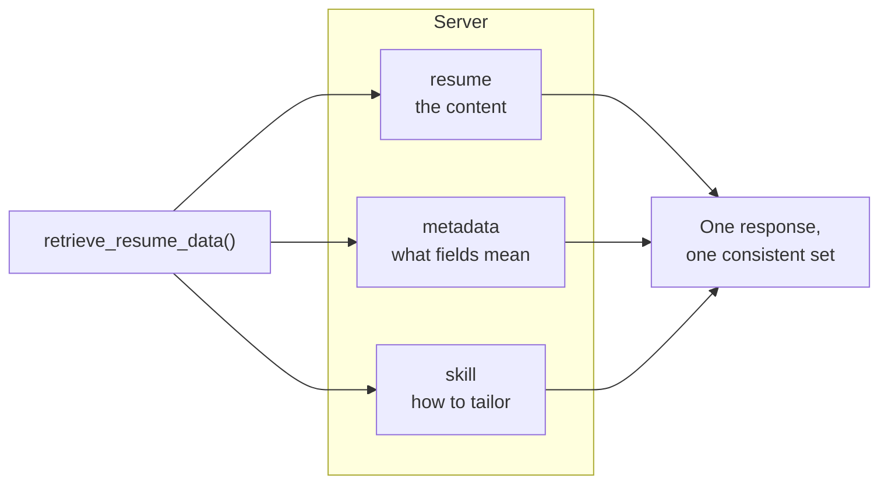
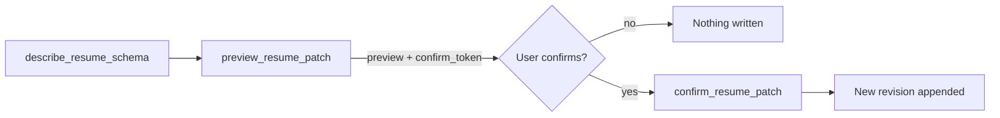
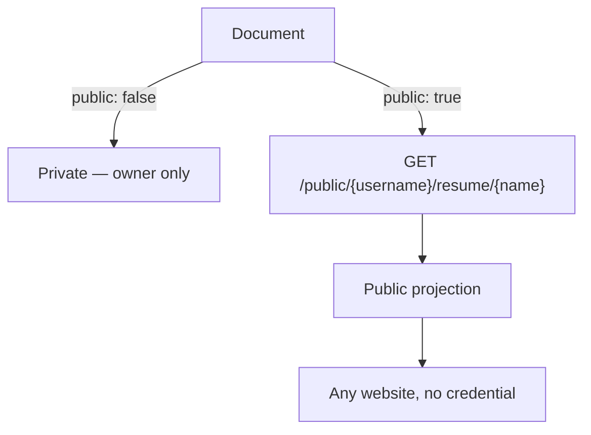
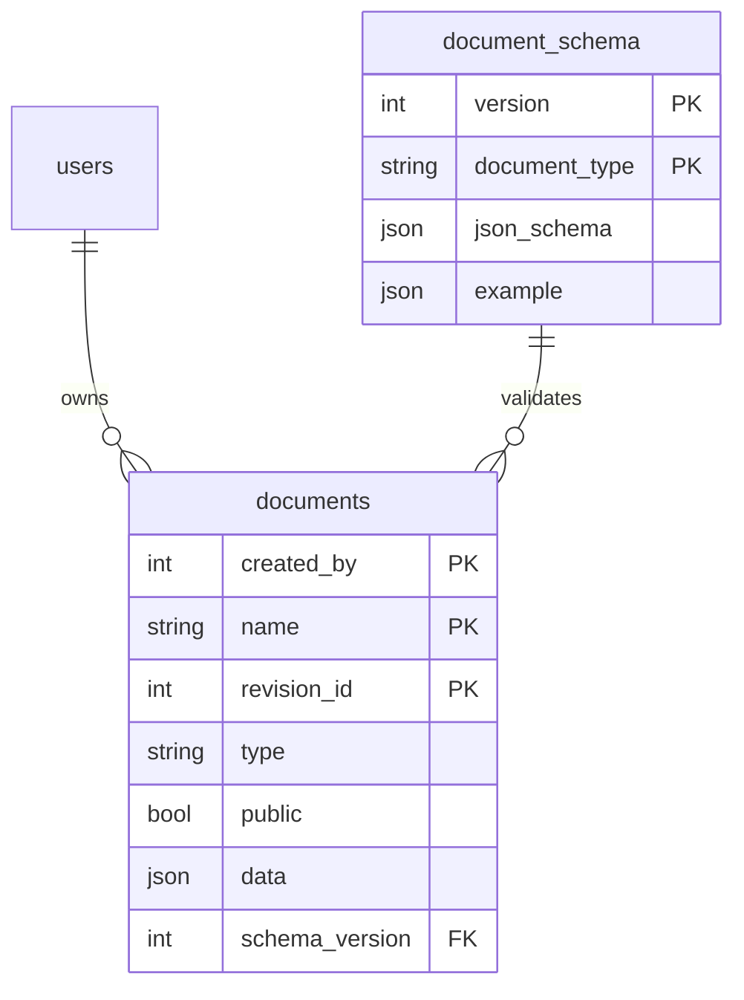

# Document Types

Three JSON document types per account. A document is identified by
`(owner, name)` — the name is yours to choose, the type is fixed when it is
created.

| Type | Write route | Holds |
| --- | --- | --- |
| `resume` | `POST /documents/resume` | A [JSON Resume 1.0](https://jsonresume.org/schema) document — work history, bullets, skills, education, contact details — extended with private fields: per-bullet tech and figures, skill ratings, narrative material |
| `metadata` | `POST /documents/metadata` | What each résumé field means, which parts are résumé-ready, how highlight ids join, what must never be published |
| `skill` | `POST /documents/skill` | The persona, the procedure, the selection and wording rules, cover-letter guidance, guardrails, and one output spec per artifact |

A route per type is what validates the payload shape on the way in. Writing a
payload whose type disagrees with the stored document's type is a `409`.

**A new account starts with all three already in place**, seeded with fictional
example content from the schema catalogue — so nothing is ever empty. Edit the
`resume` first; the other two ship as sensible defaults.

## Why the instructions are a document

Keeping the tailoring rules in a `skill` document rather than in the client's
skill file means editing them is an ordinary document write. The next run picks
them up with no skill release, and more than one client asking for the same
résumé gets the same instructions.



`retrieve_resume_data` takes all three ids and returns all three in one call,
so a tailoring run cannot pair current instructions with a stale résumé. Only
the résumé is required — a companion that isn't stored comes back as `null`
rather than failing the retrieval, so the client can say what it's working
without.

### The write path

Reading is a single call; writing to the resume over MCP is always a
preview/confirm pair (see [`docs/api.md`](api.md#mcp)) — the same
`document_type`/`revision` model above, appended to rather than replaced:



`describe_resume_schema` is stateless and read-only — call it as often as
needed to check whether a proposed change is expressible before ever calling
`preview_resume_patch`. Nothing is written until `confirm_resume_patch`
redeems the token `preview_resume_patch` issued; a preview that is never
confirmed leaves no trace beyond its own short-lived token. `metadata` and
`skill` documents have no write path here at all — see
[`docs/api.md`](api.md#documents).

## Revisions

Every write appends a revision; nothing is ever rewritten in place. A database
trigger enforces this on both SQLite and Postgres.

Reads always return the list envelope `{"data": [ ... ]}`, one element by
default:

| Parameter | Default | Effect |
| --- | --- | --- |
| `revisions` | `1` (max 50) | How many of the **most recent** revisions to return |
| `order` | `newest_first` | `newest_first` or `oldest_first` — how that slice is arranged |

`revisions=3&order=oldest_first` means the three most recent revisions, oldest
of those three first — not the three oldest overall.

`GET /documents` lists your documents — name, type, public flag, latest
revision number and note — with no content.

A write that changes nothing returns `"status": "unchanged"` with the existing
revision id, rather than creating a duplicate revision.

## Publishing



A document is served anonymously only once `public` is set on it. Flipping the
flag records a new revision even when the content is byte-identical —
publishing and unpublishing are edits, and the history should say when they
happened.

`public` is three-valued on the way in: omitting it leaves the flag as the
current revision has it, and a first write that omits it defaults closed. That
way a content edit which forgets to restate the flag can't silently take a
document offline.

### The public feed

```
GET /public/{username}/resume/{document_name}
```

No credential, and `Access-Control-Allow-Origin: *`, so any site can `fetch()`
it directly:

```js
const res = await fetch("https://your-host/public/alice/resume/resume.json");
const resume = await res.json();
```

Redaction is structural: the public and private payloads are separate model
trees with separate routes, and the redacted data is re-validated under
`extra="forbid"` before serving. A private field that survived redaction has no
field to land in and raises instead of being served.

The feed keeps two deliberate deviations from JSON Resume 1.0 —
`work[].highlights[]` and `skills[].keywords[]` carry objects rather than plain
strings — so a website can render highlight specifics and per-skill links.

### Withholding a single entry

Work entries, highlights, skills, keywords, certificates, education entries,
projects, profiles and locations each carry their own `publish: bool` (default
`true`), which withholds just that entry from the public feed while leaving it
in the private payload an MCP client reads.

| Withheld | Result in the public feed |
| --- | --- |
| A work entry or skill | Dropped entirely |
| Every highlight under a published work entry | Entry kept, with an empty highlights list |
| Every keyword under a published skill | Skill dropped |

This is **curation, not a security control**. Genuinely sensitive fields —
`basics.email`, `basics.phone`, `highlights[].tech`, `highlights[].metrics`,
`keywords[].level`, `fineTuningData` and the rest — are redacted structurally
regardless of `publish`. The flag decides which *entries* appear, never which
*attributes* of a shown entry are visible.

It is also silent to a tailoring run: an entry kept off a public site for
stealth or curation is often exactly the one worth leading with in an
application.

## The schema catalogue

Every stored revision records the `schema_version` it was written against.



`document_schema` is a historical record, populated only by migrations and
never by the application. Each row freezes that version's JSON Schema and a
fictional example, and `documents` carries a real foreign key into it — so a
revision naming a version this build doesn't know about cannot be written.

That is what let the v1 (bespoke) → v2 (JSON Resume) conversion ship as an
ordinary deploy: migrations converted every stored document in place, appending
new revisions rather than rewriting history.

One consequence if you read document history: a revision written at a version
this build no longer considers current is served **unvalidated**, as the raw
stored payload, rather than failing. Reading across the v1→v2 boundary returns
both shapes side by side. The same is true across the v2→v3 boundary below.

**What v3 changed:** `resume` gained `fineTuningData.logistics.travel` (free
text, absent by default — see the MCP schema for the field guide
distinguishing it from `onSite`) and widened `projects[].highlights[]` from
plain strings to the same object shape `work[]`/`volunteer[]` highlights
already use, so a project accomplishment can carry an id, specifics, tech,
metrics and a cover-letter story — and can lead a role family's summary the
same as a work highlight. A migration converted every stored resume's project
highlights in place, generating a slug id per highlight and dropping any
empty string rather than keeping it as a blank bullet. `metadata` and `skill`
did not change shape at v3 — only their content did, documenting the new
field and the write-back procedure — so an existing account's `metadata` and
`skill` documents were **not** touched; only a new account is seeded with the
v3 content.

`GET /documents/schemas` serves the current JSON Schema for each type you may
read — the authoritative reference for writing a client. Note that document
payloads have their defaults dropped on the way out, so an absent field means
"the schema's default", not "unset".

## Examples

`examples/` holds small fictional fixtures that validate against all three
models — enough structure to see every field, none of it real. Filled-in
documents are personal, so none are checked in.

A new account is seeded automatically, so you rarely need these. To re-seed an
existing account, or to load real content in place of the fictional starting
point, edit the three files and run:

```bash
./examples/seed-documents.sh
```

It prompts for the host and credentials, validates each file before uploading
anything, and is safe to re-run — an unchanged document reports its existing
revision rather than piling up new ones. `--dry-run` validates without
uploading.
