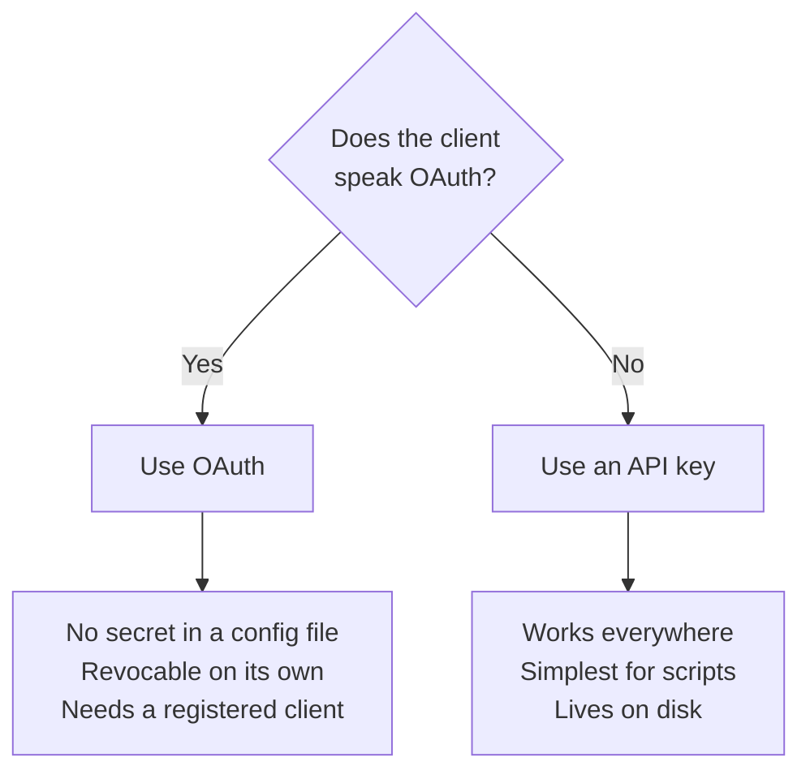

# MCP Clients

Pointing an MCP client at this service's tool server.

| | |
| --- | --- |
| Endpoint | `https://mcp.example.com/resume/mcp` |
| Transport | Streamable HTTP (not SSE, not stdio) |
| Auth | `Authorization: Bearer <api key>`, or OAuth 2.1 |
| Scopes | `resume:read`, `metadata:read`, `skill:read` |

## Which credential



Both work and neither replaces the other. For a client that supports it, OAuth
is the better route; for scripts, local development, and clients that can't,
an API key is simpler.

## Minting an API key

**The key belongs to whoever owns the documents.** Reads are scoped to the
owner, so a key minted for someone else authenticates fine and sees an empty
store.

Log in as that person and mint a key with the three reads and nothing else — no
write, no delete. This is the credential most likely to end up in a config file
on a laptop.

```bash
TOKEN=$(curl -s -X POST https://mcp.example.com/token -d 'username=YOU&password=YOURPASS' | jq -r .access_token)
```

> **If that account has MFA enabled, this needs a second step.** `/token`
> answers a correct password with a *challenge* rather than a token — and does
> so with a `200`, since the password really was correct, so there's no error
> to notice. `$TOKEN` just comes out `null` and the next command fails with a
> `401`. Redeem the challenge with a code from your authenticator:
>
> ```bash
> MFA=$(curl -s -X POST https://mcp.example.com/token -d 'username=YOU&password=YOURPASS' | jq -r .mfa_token)
> ```
>
> ```bash
> TOKEN=$(curl -s -X POST https://mcp.example.com/token/mfa -d "mfa_token=$MFA&code=123456" | jq -r .access_token)
> ```
>
> The challenge expires in five minutes. What comes back is an ordinary
> password JWT, so it satisfies the interactive-login requirement below just
> as a single-step login would.

```bash
curl -s -X POST https://mcp.example.com/api-keys -H "Authorization: Bearer $TOKEN" -H 'Content-Type: application/json' -d '{"name":"mcp-client","scopes":["resume:read","metadata:read","skill:read"]}' | jq -r .key
```

**Minting a key requires an interactive login** — an API key cannot mint or
revoke keys, so this token has to come from `POST /token` (plus `/token/mfa`
where enrolled), never from another key.

The secret is shown once. The browser client's **API Keys** screen does the
same thing with a form, and handles the MFA step for you.

Narrower is possible: `retrieve_resume_data` needs `resume:read`, and checks
the two companion scopes only when their ids are passed. `list_resume_documents`
reports only the types a key may read, so a narrowed key sees a smaller store
rather than a refusal.

### Check the key before configuring anything

This isolates a server or key problem from a client problem, and takes a
second:

```bash
curl -sS -X POST https://mcp.example.com/resume/mcp -H "Authorization: Bearer $MCP_KEY" -H 'Content-Type: application/json' -H 'Accept: application/json, text/event-stream' -d '{"jsonrpc":"2.0","id":1,"method":"initialize","params":{"protocolVersion":"2025-06-18","capabilities":{},"clientInfo":{"name":"probe","version":"0"}}}'
```

A JSON-RPC result means the server and key are good. If this fails, no client
config will help.

## Client support

| Client | API key | OAuth | Bridge needed |
| --- | --- | --- | --- |
| Claude Code | yes | yes | no |
| Claude Desktop | yes | yes | **yes**, for API keys |
| claude.ai / mobile / Cowork | no | yes | — |
| Gemini CLI | yes | — | no |
| Copilot (VS Code) | yes | — | no |
| Copilot CLI | yes | — | no |
| ChatGPT | **no** | yes | — |

**Every method below puts a credential somewhere on disk.** Prefer the ones
that read an environment variable or prompt, check file permissions where a
file is unavoidable, and don't commit any of them.

---

## Claude Code

Supports remote HTTP servers directly. Options first, then the name, then the
URL.

**With an API key:**

```bash
claude mcp add --transport http --scope user --header "Authorization: Bearer YOUR_KEY" resume https://mcp.example.com/resume/mcp
```

**With OAuth** — register a client with a pinned loopback port first (see
[Server Setup](server-setup.md#4-register-oauth-clients)):

```bash
claude mcp add --transport http --scope user --client-id YOUR_CLIENT_ID --client-secret --callback-port 41703 resume https://mcp.example.com/resume/mcp
```

`--client-secret` prompts rather than taking the value on the command line, so
it stays out of shell history. Omit it for a public client.

| `--scope` | Means |
| --- | --- |
| `local` (default) | This directory only |
| `user` | Every project — what you usually want |
| `project` | Writes `.mcp.json` into the working directory — **don't**, it would commit the key |

Verify with `claude mcp list`.

## Claude Desktop

**With OAuth** — add a custom connector, then paste the `client_id` and
`client_secret` into **Advanced settings**. Because the server advertises no
`registration_endpoint`, the connector knows to use the credentials you
supplied rather than minting its own.

**With an API key** — the desktop app takes stdio servers in its config file,
so a remote HTTP server needs the `mcp-remote` bridge. Node required.

| OS | Config file |
| --- | --- |
| Linux | `~/.config/Claude/claude_desktop_config.json` |
| macOS | `~/Library/Application Support/Claude/claude_desktop_config.json` |
| Windows | `%APPDATA%\Claude\claude_desktop_config.json` |

```json
{
  "mcpServers": {
    "resume": {
      "command": "npx",
      "args": [
        "-y", "mcp-remote",
        "https://mcp.example.com/resume/mcp",
        "--header", "Authorization: Bearer YOUR_KEY"
      ]
    }
  }
}
```

Three things that will cost you an afternoon otherwise:

- **Quit the app completely before editing.** It holds its own copy of the file
  in memory and rewrites the whole thing from that copy, so an edit made while
  it's running is discarded within a minute or two, silently. Check the tray —
  closing the window may not be enough.
- **The file must be valid JSON.** A stray trailing comma invalidates the whole
  document, and the app may regenerate it from defaults, taking your
  `mcpServers` block with it. Validate first: `jq empty <file>`.
- **On the Linux build this file also holds the app's own preferences.** Merge
  your `mcpServers` key into the existing top-level object rather than replacing
  the file, and keep a copy of the original.

If the block keeps disappearing despite the app being closed, that build is
managing the file itself. Use Claude Code instead, which writes to a config the
desktop app doesn't own.

## claude.ai, mobile, Cowork

OAuth only — add a custom connector and paste in the `client_id` and
`client_secret`. There's no field for an API key, and there shouldn't be.

`OAUTH_ALLOWED_REDIRECT_HOSTS=claude.ai` covers all of these; they share
`https://claude.ai/api/mcp/auth_callback`.

Log in as the **account that owns the documents** and approve only the scopes
that client needs. Approving as anyone else yields a connector that
authenticates successfully and sees an empty store.

## Gemini CLI

Supports remote HTTP with headers natively.

```bash
gemini mcp add --transport http --header "Authorization: Bearer YOUR_KEY" resume https://mcp.example.com/resume/mcp
```

Or by hand in `~/.gemini/settings.json`. Note the key is `httpUrl`, not `url`:

```json
{
  "mcpServers": {
    "resume": {
      "httpUrl": "https://mcp.example.com/resume/mcp",
      "headers": { "Authorization": "Bearer ${RESUME_MCP_KEY}" }
    }
  }
}
```

Gemini CLI expands `$VAR` and `${VAR}` in both fields, so the key can live in
your environment rather than the file. Prefer that.

## GitHub Copilot

**VS Code** — `.vscode/mcp.json`, or the user-level MCP config. `"type": "http"`
is **required**; without it VS Code assumes stdio and tries to execute the URL.

```json
{
  "servers": {
    "resume": {
      "type": "http",
      "url": "https://mcp.example.com/resume/mcp",
      "headers": { "Authorization": "Bearer ${input:resumeMcpKey}" }
    }
  },
  "inputs": [
    {
      "id": "resumeMcpKey",
      "type": "promptString",
      "description": "resume-cv-mcp-api MCP key",
      "password": true
    }
  ]
}
```

The `inputs` block makes VS Code prompt for the key and store it in secret
storage instead of the file — which matters, because `.vscode/mcp.json` is
usually committed.

**Copilot CLI:**

```bash
copilot mcp add --transport http --header "Authorization: Bearer YOUR_KEY" resume https://mcp.example.com/resume/mcp
```

Config lives at `~/.copilot/mcp-config.json`.

> **Known issue.** Copilot CLI has an open bug where an HTTP server returning
> `401` with `WWW-Authenticate: Bearer` sends it into OAuth discovery instead of
> falling back to the configured header
> ([copilot-cli#3100](https://github.com/github/copilot-cli/issues/3100)). This
> server returns exactly that, so if Copilot CLI reports an auth failure while
> the `curl` check above succeeds, that's why. Adding headers through the GUI
> has a separate open bug
> ([copilot-cli#2849](https://github.com/github/copilot-cli/issues/2849)) —
> prefer the CLI or the config file.

## ChatGPT

OAuth only. Developer Mode custom connectors support Streamable HTTP and SSE,
but authentication is limited to OAuth or none — there's no field for a static
header.

Developer Mode lives under **Settings → Apps → Advanced settings** (Workspace
Settings → Permissions & Roles on Enterprise), on Pro, Plus, Business,
Enterprise and Education plans on the web app.

Pre-register a client and paste the `client_id` and `client_secret` in;
registration is closed by default, so the connector won't be able to register
itself.

## Troubleshooting

Work down this list — each step rules out a layer.

| # | Check | What it tells you |
| --- | --- | --- |
| 0 | **The CDN, if there is one.** Cloudflare's Browser Integrity Check answers non-browser clients with `403` and `error code: 1010` at the edge, leaving no trace in application logs. MCP traffic is server-to-server and has no browser signature, so this hits it squarely. | A `403` for one user agent and `200` for another means the edge is filtering, not the service. |
| 1 | The `curl` initialize check above | Failure means the server or the key, not the client |
| 2 | The key's scopes — `GET /api-keys` | A key missing one of the three reads connects fine and silently exposes fewer tools |
| 3 | The key's owner | A valid key belonging to the wrong user connects and returns an empty store |
| 4 | The transport is Streamable HTTP, not SSE | This server is `http_app()`; SSE won't negotiate |
| 5 | `jq empty <config file>` | A JSON syntax error usually produces no error message in the client, just an absent server |
| 6 | For Claude Desktop, that the app was fully closed when you edited | Re-check the file after restarting to see whether your block survived |

```bash
curl -sS -o /dev/null -w '%{http_code}\n' -A 'Python-urllib/3.14' https://mcp.example.com/.well-known/oauth-authorization-server
```

### OAuth-specific checks

Run in order and stop at the first failure — a client fails silently where
these fail loudly.

```bash
curl -sS -o /dev/null -D - -X POST https://mcp.example.com/resume/mcp -H 'Content-Type: application/json' -H 'Accept: application/json, text/event-stream' -d '{}' | grep -i 'www-authenticate'
```

Expect `resource_metadata="https://mcp.example.com/.well-known/oauth-protected-resource/resume/mcp"`.
A bare `Bearer` means the resource server isn't advertising itself.

```bash
curl -sS https://mcp.example.com/.well-known/oauth-protected-resource/resume/mcp | jq
```

Expect `resource` to be `https://mcp.example.com/resume/mcp`.

```bash
curl -sS -o /dev/null -w '%{http_code}\n' -X POST https://mcp.example.com/token -d 'username=x&password=y'
```

Expect `401`, the ordinary wrong-password answer. A `400` with an `{"error":…}`
body would mean the OAuth token endpoint got mounted over the password login.

## After switching to OAuth

Revoke the API key the connector replaced — an unused credential holding
document read scopes is surface for no benefit:

```bash
curl -sS -X DELETE https://mcp.example.com/api-keys/KEY_ID -H "Authorization: Bearer $TOKEN"
```

Static keys and OAuth work alongside each other; enabling one doesn't disable
the other.
