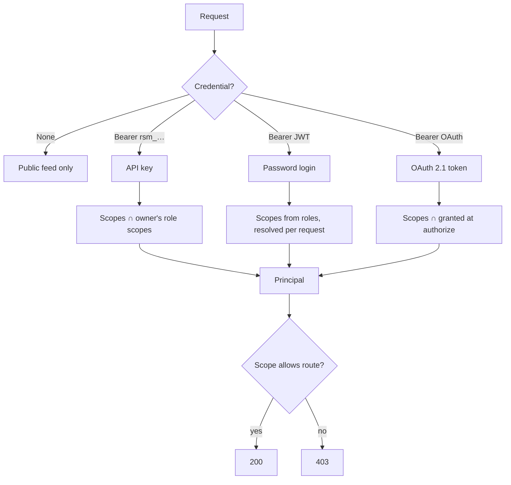
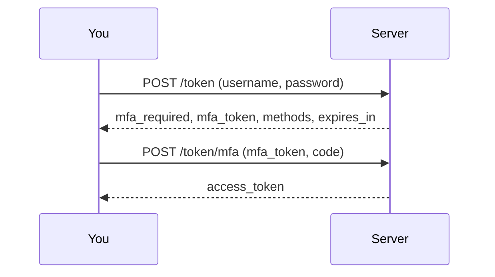
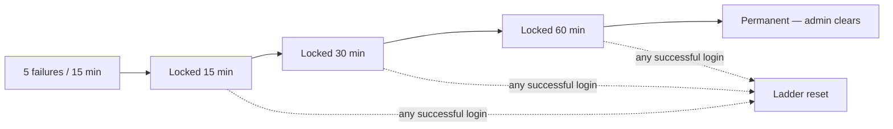
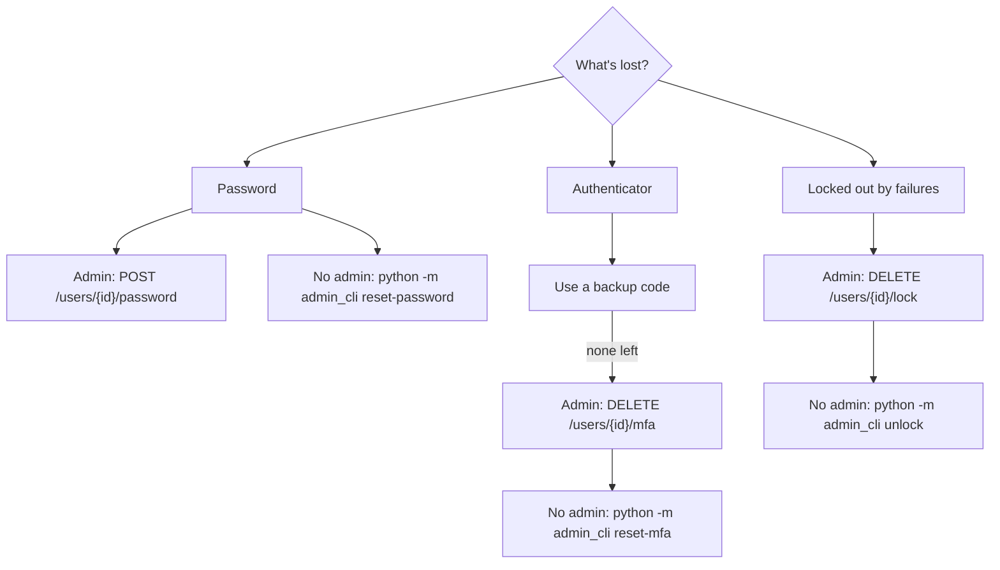

# Security

Authentication produces a **Principal**: a user id, a set of scopes, and which
kind of credential proved it. Every authorization decision reads scopes off
that object — nothing compares usernames, and an unauthenticated request has no
Principal at all.



## Scopes

One scope per document type per verb, plus one for user administration.

| | read | write | delete |
| --- | --- | --- | --- |
| **resume** | `resume:read` | `resume:write` | `resume:delete` |
| **metadata** | `metadata:read` | `metadata:write` | `metadata:delete` |
| **skill** | `skill:read` | `skill:write` | `skill:delete` |

| Scope | Grants |
| --- | --- |
| `users:admin` | Listing and creating users, resetting a password, clearing a lock, stripping MFA, registering an OAuth client |

Split by type rather than one `resume:*` family covering all three, because the
three documents aren't equally sensitive: the skill document is procedure, the
metadata is schema documentation, and the résumé is contact details and
per-bullet figures. A client that only follows the instructions has no business
holding a credential that reads the résumé.

The published projection has no scope — it takes no credential at all.

## Roles

| Role | Holds |
| --- | --- |
| `admin` | Every scope |
| `member` | Every document scope; not `users:admin` |

A member owns their documents outright, so ownership rather than the role is
what keeps them out of anyone else's.

Role → scope mapping lives in the `role_scopes` table (seeded by migration,
cached 60 seconds), not in code. Scopes are derived from roles on **every
request**, so revoking a role takes effect immediately rather than at token
expiry.

There is no `mcp` role. An MCP client authenticates **as the document owner**
with an API key narrowed to the scopes it needs — finer-grained than a role,
revocable on its own, and without a second account holding a copy of someone's
résumé.

## Credentials

| | JWT | API key | OAuth 2.1 |
| --- | --- | --- | --- |
| **Obtained by** | `POST /token` | `POST /api-keys` | Authorization code + PKCE |
| **Lifetime** | 30 min (configurable) | Until revoked | Access 30 min, refresh rotates |
| **Presented as** | `Authorization: Bearer …` | `Authorization: Bearer rsm_…` | `Authorization: Bearer …` |
| **Best for** | People, credential management | Machine clients, scripts | MCP connectors |

**JWT.** The token's subject is the user id, so renaming an account doesn't log
it out, and the token carries nothing mutable — identity and permissions are
resolved per request.

**API key.** Effective scopes are `key.scopes ∩ owner's role scopes`, so a key
can be narrowed below its owner but never widened, and it dies when its owner is
deactivated or loses the role. Keys are stored as SHA-256 of the secret, never
in the clear — 32 random bytes with no dictionary to attack, so a deliberately
slow KDF would only be a self-inflicted denial of service on a check that runs
every request.

Keys are self-service: `POST /api-keys`, `GET /api-keys` and
`DELETE /api-keys/{id}` act on the caller's own keys only. Revocation is a soft
delete, so `last_used_at` stays readable afterwards — that per-client audit
trail is most of the reason to prefer keys over a shared password.

### What an API key cannot do

Two operations require an **interactive login** (a password JWT) even for a key
that holds every scope:

| Operation | Reason |
| --- | --- |
| Minting or revoking an API key | A leaked key can't issue its own replacement ahead of revocation. Listing your own keys is allowed. |
| Anything under `/users/me/mfa` | A key that could enrol or strip a second factor would make MFA optional for whoever steals it |
| Changing `password`, `username`, `email` or `roles` | These are account-recovery fields — whoever controls them controls the account |

Changing your own password has its own route, `POST /users/me/password`, which
additionally requires the *current* password.

## Multi-factor authentication

Opt-in, per account. Two methods:

| Method | Notes |
| --- | --- |
| **Authenticator app** (TOTP, RFC 6238) | Multiple allowed — a phone and a laptop can each hold one |
| **Backup codes** | Ten single-use recovery codes; generating a set replaces the previous one |



```bash
curl -s -X POST localhost:8000/token -d 'username=YOU&password=YOURPASS'
# {"mfa_required": true, "mfa_token": "...", "methods": ["totp"], "expires_in": 300}

curl -s -X POST localhost:8000/token/mfa -d 'mfa_token=...&code=123456'
# {"access_token": "...", "token_type": "bearer"}
```

This second step is easy to miss when scripting against `/token`: a command
that reads `.access_token` off the first response gets `null` for an enrolled
account. Anything needing an interactive login — minting an API key,
registering an OAuth client — has to go through `/token/mfa` first. See
[Minting an API key](mcp-clients.md#minting-an-api-key).

The challenge is a signed JWT, not a database row — nothing is written to issue
it, and it expires on its own in five minutes. It is bound to the password hash
in force when minted, so a password change invalidates every outstanding
challenge, and it is scoped to the surface that issued it: a challenge from
`/token` can't be redeemed at the docs login or the OAuth authorize flow. The
docs login and `POST /oauth/authorize` gain the same second step in the same
shape.

**TOTP secrets are encrypted at rest** with Fernet under `MFA_ENCRYPTION_KEYS`,
so a database read alone doesn't mint a second factor for someone's account.
The key lives in the application process, so this defends against a leaked
backup, a SQL-injection read, or a dump pasted into a support ticket — not
against a compromised host. Backup codes are hashed rather than encrypted,
which is what lets them keep working if the encryption key is ever lost.

**Back the encryption key up somewhere other than beside the database dump.** A
backup containing both is a backup with no encryption.

Rotation is prepend-and-wait: add a new key ahead of the old one, and each
credential is re-sealed under it the next time that owner logs in.

## Login throttling

Failed password logins are counted per account and per calling address.
`/token`, the docs login and `POST /oauth/authorize` share one code path, so
none can be used to walk around the counter on the others. A wrong MFA code
counts the same way.



A locked account gets `429` with `Retry-After`; a permanently locked one gets a
plain `401`, because there's no wait to communicate.

**A successful login resets the ladder.** That's what makes a permanent lock
safe to have — an account in daily use can't be walked up to one by an outsider
guessing at it.

**A lock closes the password path only.** It is deliberately not the `active`
flag, which is checked on every credential and would kill live sessions and API
keys too. So an admin locked out of `/token` can still act with a key they
already hold.

The per-address tally (20 failures in 15 minutes bans the address for 15)
catches what the per-account one can't see: one guess each across a list of
usernames. Address bans are never permanent — an address is a lease, not an
identity.

API keys are not throttled: 32 bytes of randomness looked up by an indexed
prefix, with no dictionary to attack and no slow hash to exhaust. A lockout
would add a denial-of-service surface and no defense.

Every threshold is configurable — see
[Server Setup](server-setup.md#auth--login-throttling). Getting
`AUTH_TRUSTED_PROXY_HOPS` right matters most: set it wrong and every caller is
throttled as the proxy.

## Account recovery



Backup codes exist precisely so an admin usually isn't needed. When one is:

| Route | API key enough? |
| --- | --- |
| `GET /users` | Yes — read-only |
| `DELETE /users/{id}/lock` | **Yes** — a locked-out admin's own key must be able to clear it |
| `POST /users` | No — interactive login |
| `POST /users/{id}/password` | No — interactive login |
| `DELETE /users/{id}/mfa` | No — interactive login |
| `GET`/`POST`/`DELETE /oauth-clients` | No — interactive login |

The pattern: an operation a locked-out admin needs for *themselves* stays open
to a key; one that could become a fresh way into the service, or into someone
else's account, does not.

`admin_cli` works directly against the database for when there's no admin to
ask. Its `reset-mfa` deletes rows rather than reading them, so it needs no
encryption key — which makes it the break-glass path when `MFA_ENCRYPTION_KEYS`
itself is the thing that's lost.

```bash
python -m admin_cli unlock --list
```

## The docs are not public in production

FastAPI serves `/docs`, `/redoc` and `/openapi.json` without a credential — a
complete index of every route, payload shape and security scheme. Where
`ENVIRONMENT=production`, all three sit behind an HTML login: a username and
password, then a code for an MFA-enrolled account, then a signed `HttpOnly`
cookie good for an hour (`DOCS_SESSION_MINUTES`).

All three routes, not just the two pages — the pages are only renderers for the
schema, so guarding them and leaving `/openapi.json` open would guard nothing.

The credential is checked by the same `authenticate_user` call `/token` makes,
so there's no separate docs password to rotate, and deactivating a user closes
this door with the rest — the cookie is bound to the password hash in force
when it was issued.

Any active account will do. This gates who reads the route list, not what they
can call; every route behind it still enforces its own scopes.

## Browser origins

The authenticated routes (`/token`, `/documents`, `/api-keys`, `/users/*`)
require an explicit origin allowlist in `CLIENT_ALLOWED_ORIGINS` — a bearer
token is only as private as the set of origins allowed to read a response
carrying it. Empty by default, so no browser can read these responses until it
is set.

Serving the client same-origin via `CLIENT_HTML_PATH` sidesteps this entirely,
and is the recommended arrangement — see
[Server Setup](server-setup.md#browser-client).

Only the public feed carries `Access-Control-Allow-Origin: *`, and no route
sends `Access-Control-Allow-Credentials`. The docs-session cookie is the one
cookie in the service, read only by `routers/docs.py`.

**On `null` in `CLIENT_ALLOWED_ORIGINS`:** local use only. `null` is not just
the `file://` origin — it's what *any* website gets by putting a request inside
a sandboxed iframe, so unlike every other entry it names no one. Prefer a
`http://localhost:PORT` origin if you have the choice.
